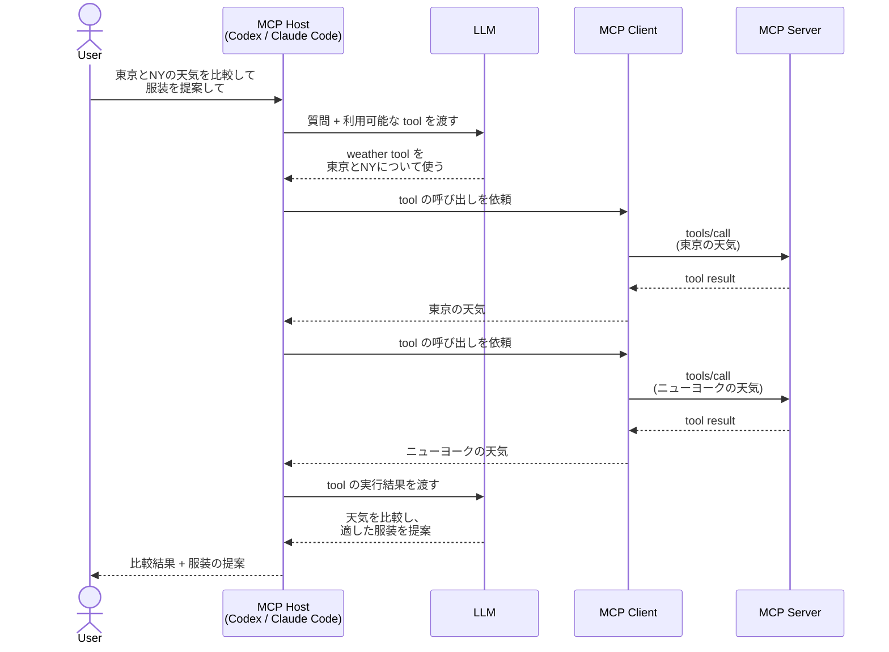

# MCP

MCP 公式ページの [Build an MCP server](https://modelcontextprotocol.io/docs/2026-07-28/develop/build-server) で MCP サーバーのサンプル実装が公開されている。
ここでそれを参考にローカルに MCP サーバーを追加してみたときの手順をまとめる。

## MCP Server

基本的にこのページのコードをコピペしたら完成する。
ここでは `./weather/weather-py` ディレクトリに MCP サーバーのコードを作った。

注意として、この MCP サーバーではアメリカの天気しか取得できないので、東京の天気を取得するには別途 tool を作る必要がある。

## MCP Host / MCP Client

MCP Host は LLM を利用し、ユーザー・LLM・MCP Server 間の処理を調整するアプリケーションである。
たとえば Codex や Claude Code がこれに相当する。
これらの MCP Host は MCP Server と通信するための MCP Client を内蔵している。
MCP Client は tools/list や tools/call などの MCP のリクエストを MCP Server に送り、その結果を MCP Host に返す。

公式ページでは [MCP Client を構築しよう](https://modelcontextprotocol.io/docs/2026-07-28/develop/build-client) という項目がある。

このチュートリアルは、MCP Client 単体だけを実装しているわけではない。実際には MCP Client を内蔵し、LLM の呼び出しや tool の選択・実行結果の受け渡し、ユーザーとの入出力まで行う簡易的な MCP Host（AI アプリケーション）を構築している。

これを実装せずとも、手元の Claude Code や Codex で MCP Server に接続して動作確認できる。

たとえば Codex に「東京とニューヨークの天気を比較して、出張に適した服装を提案して」と聞くと、

1. 接続している MCP Server から利用可能な tool を把握する。Host は tools/list などで取得した tool の情報を LLM に利用可能な tool として提示する。
2. 利用可能かつ有効な tool の有無を判断する。
3. 有効な tool があれば tools/call を実行して、MCP Server に登録されている tool を呼び出す。
4. MCP Server の tool の実行結果を Codex が解釈し、ユーザーに返す。

この一連の処理をよしなにやってくれることで、単に東京とニューヨークの天気を比較するだけでなく、出張に適した服装の提案までしてくれる。

[MCP Client を構築しよう](https://modelcontextprotocol.io/docs/2026-07-28/develop/build-client) では、Codex や Claude Code などの MCP Host が行っている、MCP Server への接続、tool の取得、tool の呼び出し、LLM への実行結果の受け渡しといった処理を、自分のアプリケーションに組み込んでいる。

これが必要になるのは、既存の Codex や Claude Code を MCP Host として利用するのではなく、自分の AI アプリケーション自身から MCP Server を利用したい場合である。

たとえば世界中の天気について自然言語で質問できる Web Application を公開するとする。
利用者自身が Codex や Claude Code を使うのであれば、それらを MCP Host として MCP Server に接続できる。
一方、利用者が Web ブラウザだけを使うことを想定するなら、Web Application 側が MCP Host となり、MCP Client を通じて MCP Server を利用する必要がある。

このように、Codex や Claude Code などの既存の MCP Host に処理を任せるのではなく、自分の AI アプリケーション自身を MCP Host として MCP Server を利用したい場合は、MCP Client の機能をアプリケーションに組み込む必要がある。

下図でいうと、 Browser から利用する Web Application が MCP Host となり、MCP Client を利用して MCP Server に接続することになる。



## Codex（ChatGPT App）から MCP Server を呼び出す

[Build an MCP server](https://modelcontextprotocol.io/docs/2026-07-28/develop/build-server) で作ったローカルの MCP Server を、Codex（ChatGPT App）から呼び出す方法をまとめる。

- [Connect Codex to an MCP server](https://learn.chatgpt.com/docs/extend/mcp?surface=app#app-connect-codex-to-an-mcp-server)

抜粋すると `~/.chatgpt/config.toml` に以下のように書き込む。

```toml
[mcp_servers.weather]
command = "<uv へのパス>"
args = [
  "--directory",
  "<weather-py があるディレクトリへのパス>",
  "run",
  "weather.py",
]
```

uv へのパスは `which uv` で確認できる。

これを設定した状態で codex を起動して「東京とニューヨークの天気を比較して、出張に適した服装を提案して」のような質問をしたら MCP Server を利用して答えてくれるはずだ。

ChatGPT desktop app なら、「設定 > プラグイン」から登録されている MCP Server を確認できる。
Codex なら `/mcp` と入力すると、登録されている MCP Server の一覧が表示される。

## Claude Code から MCP Server を呼び出す

Claude code (CLI) で MCP Server を呼び出す方法をまとめる。

user スコープ → `~/.claude.json` に以下のように書き込む。

```json
{
  "mcpServers": {
    "weather": {
      "type": "stdio",
      "command": "uv",
      "args": [
        "run",
        "--directory",
        "<weather-py があるディレクトリへのパス>",
        "python",
        "weather.py"
      ],
      "env": {}
    }
  }
}
```

プロジェクトにおくなら、プロジェクトルートの `.mcp.json` に同様に設定する。

`~/.claude/settings.json` は Claude Code の権限や Hooks などの一般設定を管理するファイルであり、通常の MCP サーバー設定を保存するファイルとは異なる点に注意する。
allowedMcpServers / deniedMcpServers のようなMCP利用ポリシーを設定する場合は、`~/.claude/settings.json` に設定するので一概に無関係というわけではない。
