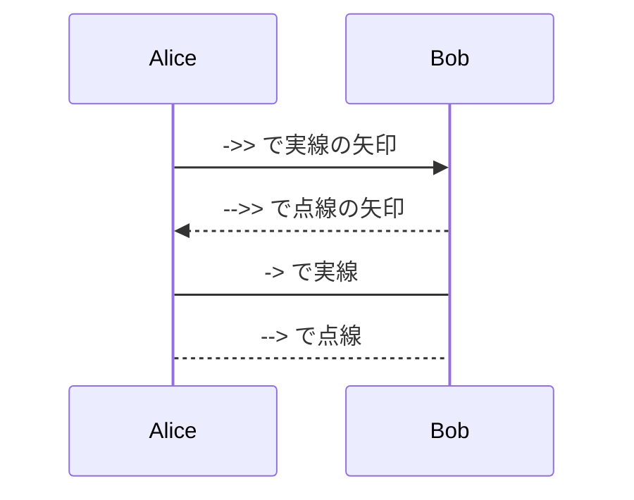
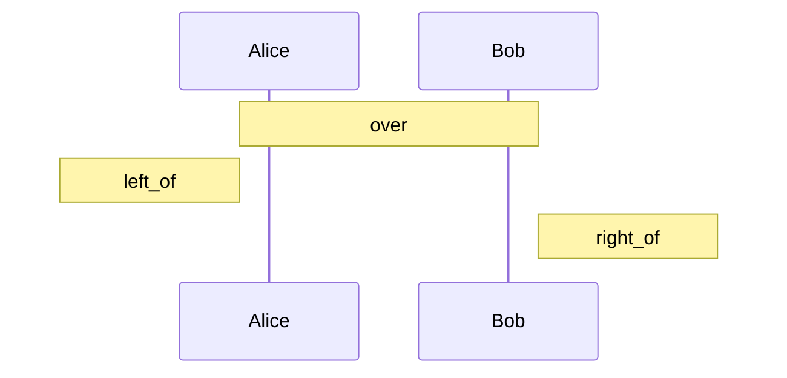
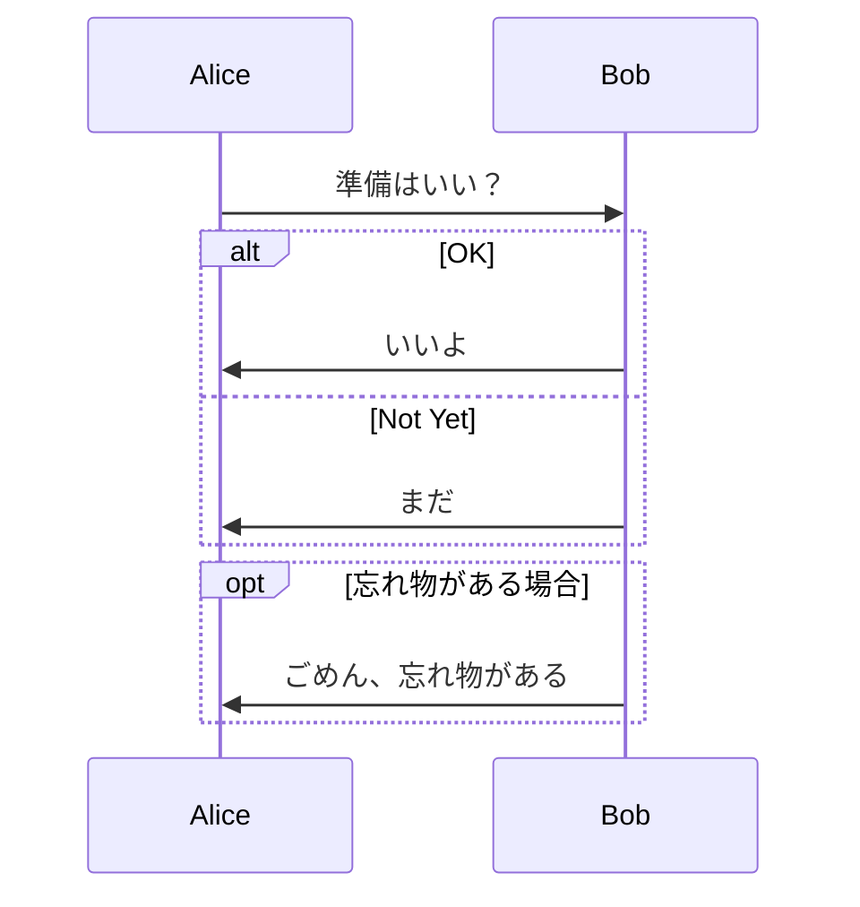
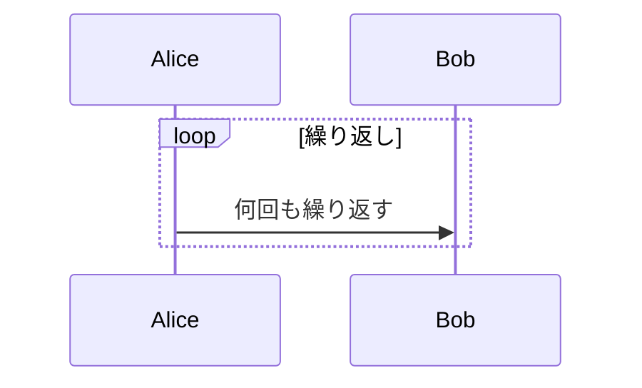
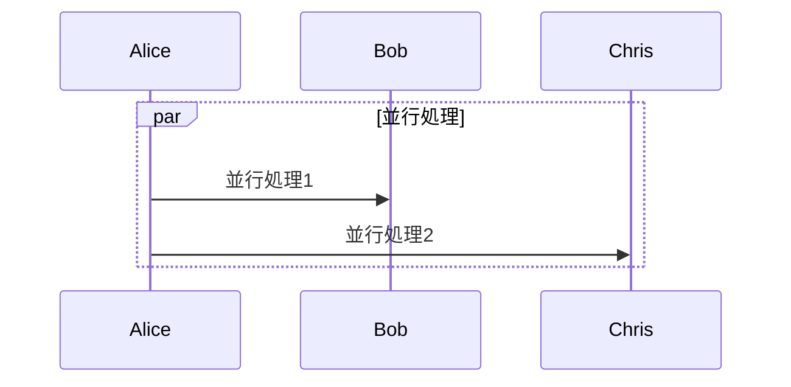
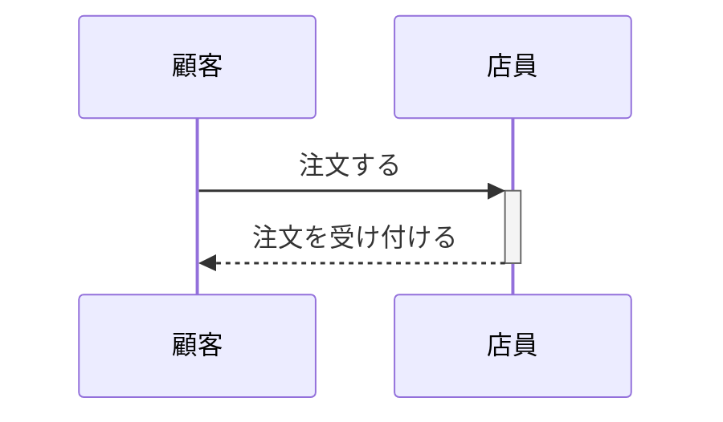

# Mermaid でシーケンス図を書く

## 線の書き方

```mermaid
sequenceDiagram # まず、sequenceDiagram でシーケンス図を描くことを宣言する

participant Alice
participant B as Bob # このように as で別名をつけることもできる

Alice->>B: ->> で実線の矢印
B-->>Alice: -->> で点線の矢印

Alice->B: -> で実線
Alice-->B: --> で点線
```

## コメントの書き方

```mermaid
sequenceDiagram
participant Alice
participant B as Bob

# Note 場所 Participant と書くことでコメントを書き込める
Note over Alice, B: over
Note left of Alice: left_of
Note right of B: right_of
```

## 分岐、繰り返し、並行

```mermaid
sequenceDiagram

participant Alice
participant Bob

Alice->>Bob: 準備はいい？
alt OK
    Bob->>Alice: いいよ
else Not Yet
    Bob->>Alice: まだ
end

# opt は条件が成立した場合にのみ、分岐する
opt 忘れ物がある場合
    Bob->>Alice: ごめん、忘れ物がある
end
```

```mermaid
sequenceDiagram
participant Alice
participant Bob
loop 繰り返し
    Alice->>Bob: 何回も繰り返す
end
```

```mermaid
sequenceDiagram
participant Alice
participant Bob
participant Chris
par 並行処理
    Alice->>Bob: 並行処理1
    Alice->>Chris: 並行処理2
end
```

## 処理中の状態を表す

```mermaid
sequenceDiagram
participant A as 顧客
participant B as 店員

A->>+B: 注文する
B-->>-A: 注文を受け付ける
```
