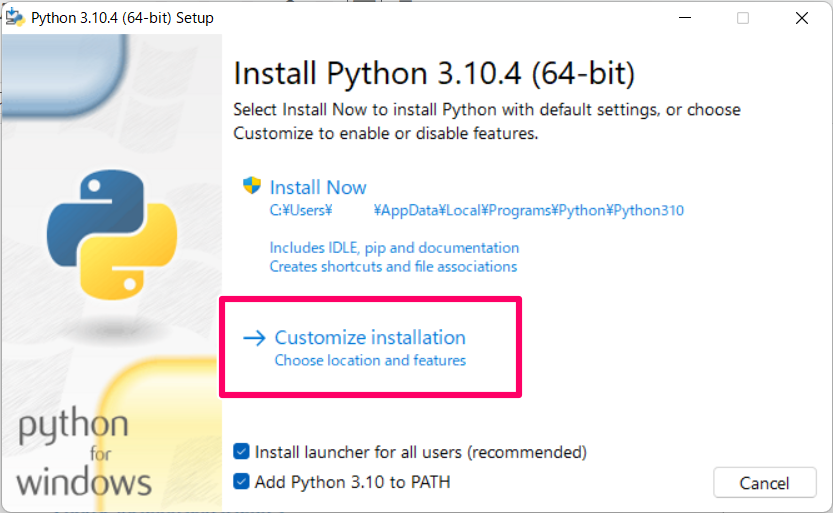

# Windows で複数バージョンの Python を使用する

Windows は [Python ランチャー](https://docs.python.org/ja/3/using/windows.html#:~:text=Windows%20%E3%81%AE%20Python%20%E3%83%A9%E3%83%B3%E3%83%81%E3%83%A3%E3%81%AF%E3%80%81%E7%95%B0%E3%81%AA%E3%82%8B%20Python%20%E3%81%AE%E3%83%90%E3%83%BC%E3%82%B8%E3%83%A7%E3%83%B3%E3%81%AE,%E3%83%90%E3%83%BC%E3%82%B8%E3%83%A7%E3%83%B3%E3%82%92%E5%AE%9F%E8%A1%8C%E3%81%97%E3%81%BE%E3%81%99%E3%80%82)という便利なツールのおかげで容易に複数のインタプリタを利用できる。

## Python ランチャー

Python ランチャーは `py` コマンドで実行する。

```bash
$ py
Python 3.11.4 (tags/v3.11.4:d2340ef, Jun  7 2023, 05:45:37) [MSC v.1934 64 bit (AMD64)] on win32
Type "help", "copyright", "credits" or "license" for more information.
>>> quit() # Python の入力から抜けるときは quit() と入力する
```

py コマンドが実行できない場合は Python ランチャーがインストールされていないので Python インストーラーからインストールする。

<details>
<summary><b>Python ランチャーのインストール方法</b></summary>
<div style="border: 2px solid; border-radius: 12px; padding: 8px;">

Python 3.3 以上のインタプリタバージョンをインストーラから入手する際にオプションとしてインストールできる。

インストーラから Python をインストールする手順の画像の箇所にて、Install launcher for all users (recommended)」をチェックすることで、Python ランチャーがインストールされる。



Python ランチャーで Python を運用していく場合は、その下の Add Python 3.10 to PATH をチェックして Python を環境変数に追加する必要はない。

</div>
</details>

## py コマンド

インストール済みのインタプリタバージョンを表示する。

```bash
$ py --list
 -V:3.11 *        Python 3.11 (64-bit)
 -V:3.9           Python 3.9 (64-bit)
 -V:3.8           Python 3.8 (64-bit)
```

システムにインストールされているすべての Python バージョンを一覧表示する。

```bash
$ py -0p
 -V:3.11 *        C:\Users\UserName\AppData\Local\Programs\Python\Python311\python.exe
 -V:3.9           C:\Users\UserName\AppData\Local\Programs\Python\Python39\python.exe
 -V:3.8           C:\Users\UserName\AppData\Local\Programs\Python\Python38\python.exe
```

どちらも `*` がついているバージョンが py コマンドでデフォルトで使用されるバージョンになる。
インタプリタバージョンを指定して Python を実行する場合は `py` のうしろに `-3.9` などとバージョンをつけてコマンドを実行する。

```bash
$ py
Python 3.11.4 (tags/v3.11.4:d2340ef, Jun  7 2023, 05:45:37) [MSC v.1934 64 bit (AMD64)] on win32
Type "help", "copyright", "credits" or "license" for more information.
>>> quit()

$ py -3.9 # バージョンを指定して実行する
Python 3.9.1 (tags/v3.9.1:1e5d33e, Dec  7 2020, 17:08:21) [MSC v.1927 64 bit (AMD64)] on win32
Type "help", "copyright", "credits" or "license" for more information.
>>> quit()
```

## \*.py ファイルを実行する

.py で書かれたスクリプトを実行する場合は下記のようにする。

```bash
py [ファイル名]
py -3.9 [ファイル名] # バージョンを指定する場合
```

スクリプトの１行目に次のように shebang を記載することで、 py コマンドでバージョンを指定せずとも、Python ランチャーが自動的にバージョンを判断してスクリプトを実行してくれる。

```python
#!/usr/bin/env python3.9
```

## パッケージの管理

ここでは、poetry などのパッケージ管理ツールを使わず、標準の Python のパッケージ管理ツール pip を使用する場合の説明をする。
Python ランチャーを使用してモジュールをスクリプトとして実行するときは下記のように `-m` オプションをつける。

```bash
$ py -m pip list
Package    Version
---------- -------
pip        21.1.1
```

なお、パッケージは Python インタプリタごとに別で管理されているので、複数の Python インタプリタバージョンで同じパッケージを利用する場合はそれぞれでインストールする必要がある。

pip 自体の使用方法はここでは割愛する。
